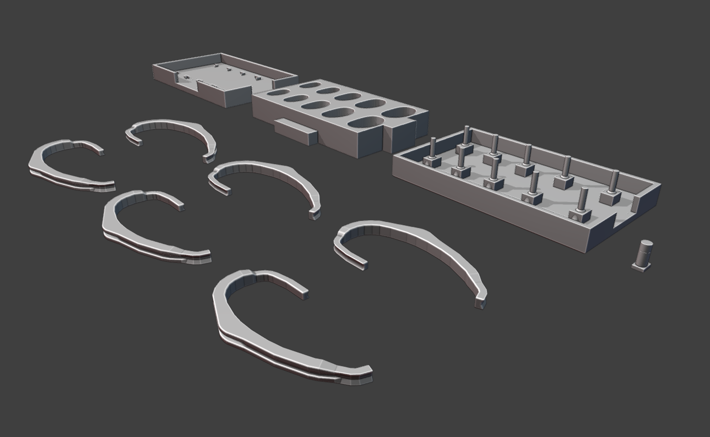

# pirate-extensions
Adaptions to the PIRATE In-Ear Microphones

## Description
This repository contains supplementary materials for adapted in-ear microphones [1], based on the PIRATE microphones design by Denk et al. [2].

## Contents

You can find all the 3d files in the stl-fileformat ready to 3D print as well as a single blender scene containing all the objects in the pirate-models folder and its subfolders 

A detailled step by step guide on how to build the pirate-extension can be found [here](step-by-step-guide/STEP_BY_STEP.md)

## REFERENCES

[1] D. Bau, O. Moschner, C. Poerschmann "Adapting the PIRATE Design for Cost-Effective In-Ear Microphones", Proceedings of the 50th DAGA, Hannover, Mar. 2024

[2] F. Denk, F. Brinkmann, A. Stirnemann, and B. Kollmeier, “The PIRATE: an anthropometric earPlug with exchangeable microphones for Individual Reliable Acquisition of Transfer functions at the Ear canal entrance”, Proceedings of the 45th DAGA, Rostock, Mar. 2019
